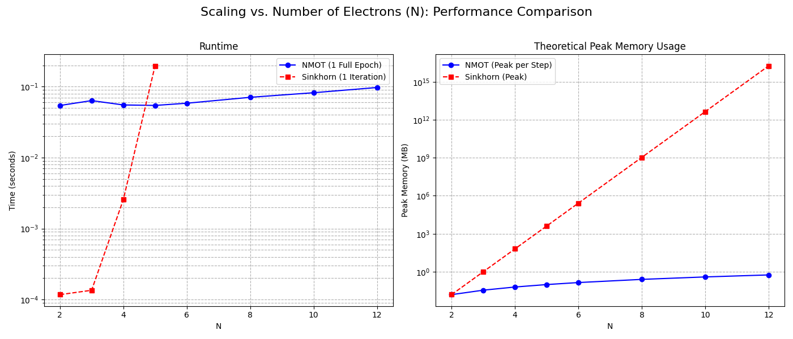

# Neural Multimarginal Optimal Transport (NMOT) for Coulomb Cost


This repository contains the official PyTorch implementation for the paper: **"Neural-Networks Based Approache for Multimarginal Optimal Transport Problems with Coulomb Cost"** by Hamza Elotmani.

This project introduces a novel approach, Neural Multimarginal Optimal Transport (NMOT), which leverages the scalability of neural networks to solve the multimarginal optimal transport (MOT) problem with a Coulomb cost. This problem is central to understanding electron correlation in the strong interaction limit of Density Functional Theory (DFT).

Our method parameterizes the dual potentials of the entropically regularized MOT problem with a neural network, which is then optimized using mini-batch gradient descent. This approach overcomes the severe scalability limitations of classical grid-based solvers like Sinkhorn/IPFP, enabling the analysis of systems with more electrons and finer density discretizations.

## Core Concept

The traditional Kantorovich formulation of the MOT problem is computationally expensive. We instead solve its entropically regularized dual formulation:

$$
\max_{u} \left\{ N \int u(x)d\mu(x) - \epsilon \int \exp\left(\frac{\sum_{i=1}^N u(x_i) - c(X)}{\epsilon}\right) d\mu^{\otimes N}(X) \right\}
$$


Instead of discretizing the functions on a grid, we represent the dual potential `u(x)` with a single neural network `f_θ(x)`. The maximization is then performed by training the network's parameters `θ` via stochastic gradient descent on mini-batches of samples, making the method scalable and memory-efficient.


*(**Action Required:** After running the benchmark, commit the generated plot `benchmark_mc_vs_N.png` to your repository so it appears here.)*

## Implemented Experiments

This repository allows you to reproduce all the validation and benchmark experiments from the paper:

### 1. Accuracy Validation
Comparison of the learned Kantorovich potentials (`u(x)`) and co-motion maps (`f(x)`) against known analytical solutions.
- **N=2, d=1:** Uniform and Triangular density profiles.
- **N=3, d=1:** Uniform density on `[0, 1]`.
- **N=4, d=1:** Uniform density on `[0, 1]`.
- **N=2, d=2 & d=3:** Radially symmetric uniform density (unit disk and ball).

### 2. Performance Benchmarks
A systematic comparison of the NMOT solver against a theoretical brute-force Sinkhorn algorithm to demonstrate scalability.
- **Scaling vs. Number of Electrons (N):** Measures runtime and memory as `N` increases from 2 to 12.
- **Scaling vs. Discretization Size (M):** Measures runtime and memory as the number of support points increases.

## Installation

1.  Clone the repository:
    ```bash
    git clone https://github.com/Elotmanix/Neural-Networks-Based-Approache-for-Multimarginal-Optimal-Transport-Problems-with-Coulomb-Cost
    cd Neural-Networks-Based-Approache-for-Multimarginal-Optimal-Transport-Problems-with-Coulomb-Cost
    ```

2.  Create and activate a virtual environment (recommended):
    ```bash
    python -m venv venv
    source venv/bin/activate  # On Windows, use `venv\Scripts\activate`
    ```

3.  Install the required packages:
    ```bash
    pip install -r requirements.txt
    ```

## Usage

All experiments can be run from the command line using `main.py`. The output plots will be saved in the `plots/` directory.

```bash
python main.py <experiment_name>
```

Available `experiment_name`s:

| Command         | Description                                                      |
| --------------- | ---------------------------------------------------------------- |
| `1d_uniform`    | Accuracy test for N=2, d=1 uniform density.                      |
| `1d_triangular` | Accuracy test for N=2, d=1 triangular density.                   |
| `2d_radial`     | Accuracy test for N=2, d=2 uniform disk.                         |
| `3d_radial`     | Accuracy test for N=2, d=3 uniform ball.                         |
| `n3_uniform`    | Accuracy test for N=3, d=1 uniform density.                      |
| `n4_uniform`    | Accuracy test for N=4, d=1 uniform density.                      |
| `benchmark`     | Runs the full suite of performance and scalability benchmarks.   |


### Example

To run the performance benchmark comparing NMOT and Sinkhorn:
```bash
python main.py benchmark
```

## Project Structure

```
Neural-Networks-Based-Approache-for-Multimarginal-Optimal-Transport-Problems-with-Coulomb-Cost/
├── main.py                 # Main script to run experiments
├── README.md               # This file
├── requirements.txt        # Project dependencies
├── nemot_solver/           # Core library code
│   ├── solver.py           # Contains the NMOT solver classes
│   └── data_utils.py       # Helper functions for data and analytics
└── experiments/            # Scripts for each specific experiment
    ├── run_1d_uniform.py
    ├── ...
    └── run_benchmark.py
```


## Acknowledgments

This work is inspired by the foundational research of Benamou et al. on numerical methods for OT with Coulomb cost and Tsur et al. on Neural Entropic Multimarginal Optimal Transport.
